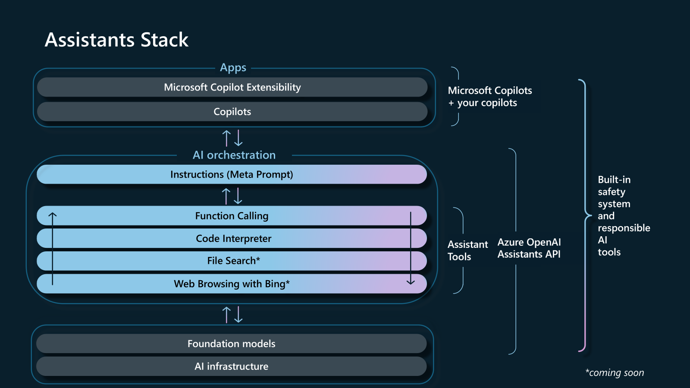
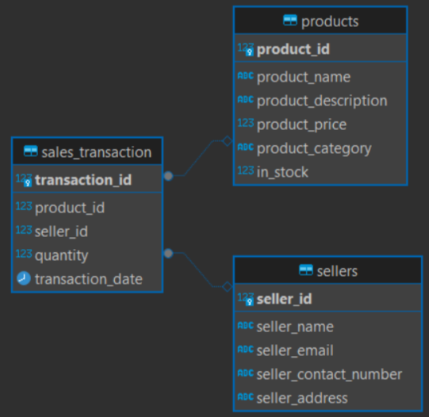

#  Azure Open AI Assistant for Natural Language to SQL
# Assistant NL2SQL

Assistant NL2SQL is a natural language processing tool that converts natural language queries into SQL queries. This project aims to simplify database querying for users who may not be familiar with SQL syntax.

## Features

- Convert natural language questions to SQL queries
- Support for PostgreSQL and BigQuery
- User-friendly interface
- High accuracy and performance
- Auto correction given possible errors


## Stack <br>

- Use Azure Open AI Assistants API for AI Orchestration, on top of GPT4o Model
- Built our own [tools postgres](src/lib/tools_postgres.py) and [tools bigquery](src/lib/tools_postgres.py) using Function Calling, to interact with the databases


## Setup

To setup the project, clone the repository and install the dependencies:

```bash
git clone https://github.com/Azure-Samples/assistant-nl2sql.git
cd assistant-nl2sql

python -m venv venv
source venv/bin/activate

pip install -r requirements.txt
```

## Usage

1. **From command line:** 
- To use the tool, run the following command (for a postgresql assistant):

```bash
python src/main.py --database postgresql  
```
Then, follow the on-screen instructions to input your natural language query.

- If you want a bigquery assistant, try:
```bash
python src/main.py --database bigquery 
```

2. **Using a streamlit app for front end:**
- To launch the app locally:
```bash
streamlit run app.py
```

3. **Docker Image and Container:**
You need to install [Docker](https://www.docker.com/products/docker-desktop/) 

- Build the docker image:
```bash
docker build -t bigqueryassistant-app:latest .
```

```bash
docker build --platform=linux/amd64 -t bigqueryassistant-app:latest .
```


- Start the services defined in the [docker-compose](docker-compose.yml)
```bash
docker-compose up
```

## Examples
You can test the assistant with the following examples:

Input:
```
Give me the seller name with the best sales performance
```

Input:
```
Show me the total sales amount for each seller
```

## Speech-to-Text Functionality

We have added a new feature that allows users to input questions via speech. This functionality uses Azure Cognitive Services for speech recognition. Here are the key points:

- **Speech Recognition**: Users can click on the microphone icon to record their question. The recorded audio is sent to Azure Cognitive Services for speech-to-text conversion.
- **Text Input**: Users can still input their questions via text using the input box.
- **Integration**: The recognized text from the speech input is processed in the same way as text input, providing a seamless experience.

### Additional Setup for pyaudio

- **macOS**: On macOS, you need to install portaudio using Homebrew:
```bash brew install portaudio```

- **Windows**: Download the appropriate portaudio binary from  ([PortAudio](https://www.portaudio.com/download.html)) Downloads.
Extract the files and follow the instructions to install.

- **Windows**: On Linux, you can install portaudio using your package manager. For example, on Debian-based systems:
```bash brew install portaudio```
After installing portaudio, you can install pyaudio using pip:
```pip install pyaudio```

### How to Use

1. **Text Input**: Simply type your question in the input box and press Enter.
2. **Speech Input**: Click on the microphone icon next to the input box to start recording your question. The recognized text will be displayed and processed.

## Infrastructure
You can use the shell script `set_up.sh` to set up the infrastructure on Azure. This script will create a resource group, a storage account, a container, and a PostgreSQL database. To run the script, you need to have the Azure CLI installed and be logged in. You can install the Azure CLI by following the instructions [here](https://docs.microsoft.com/en-us/cli/azure/install-azure-cli).

Its necessary to install an extension: az extension add -n ml

Please, pay attention to the costs of the resources created by the script. 

- Edit the parameters section in [set_up.sh](set_up.sh)

| Parameter  | Example | Description |
| ---------|---------|---------|
prefix | demoassistant | The prefix for all resources that will be created |
location | eastus2 | The location where resources will be created |
query_examples_file_name | ./data/examples.csv | The file with the curated example of queries
secret_file_name | service-account.json | The service account secrets if using bigquery
bigquery_dataset_id | sales_sample_db | The name of the dataset if using bigquery |                
   
- To create resources for the postgresql assistant 
```bash
az login
./set_up.sh run_all postgresql
```

- To create resources for the bigquery assistant:<br>
You must have a service-account saved [inside here](./secrets/). 
For more information [see](https://cloud.google.com/iam/docs/service-accounts-create).

```bash
az login
./set_up.sh run_all bigquery
```

- You can provide [examples](data/examples.csv) of queries that the assistant can use as few shot examples. Those examples will be indexed and available to the assistant through a tool call. The examples should be adapted to the database syntax.

## Supported Databases:

- **PostgreSQL Database**
    We provide a sample PostgreSQL tables that you can use to test the assistant. 

    ```python
    python util/create-sample-database.py
    ```

    - Table's Schema <br>
    

- **BigQuery**
    The same schema can be recreated in Google BigQuery for you to test the assistant. 

    ```python
    python util/create-sample-database-bigquery.py
    ```

**Note:** If you ran the shell scripts that create the infrastructure, the data has already been created for you, **NO NEED TO RUN THESE SCRIPTS AGAIN** 

## Contributing

We welcome contributions! Please read our [contributing guidelines](CONTRIBUTING.md) before submitting a pull request.

## License

This project is licensed under the MIT License. See the [LICENSE](LICENSE) file for details.

## Contact

For any questions or feedback, please open an issue on GitHub.